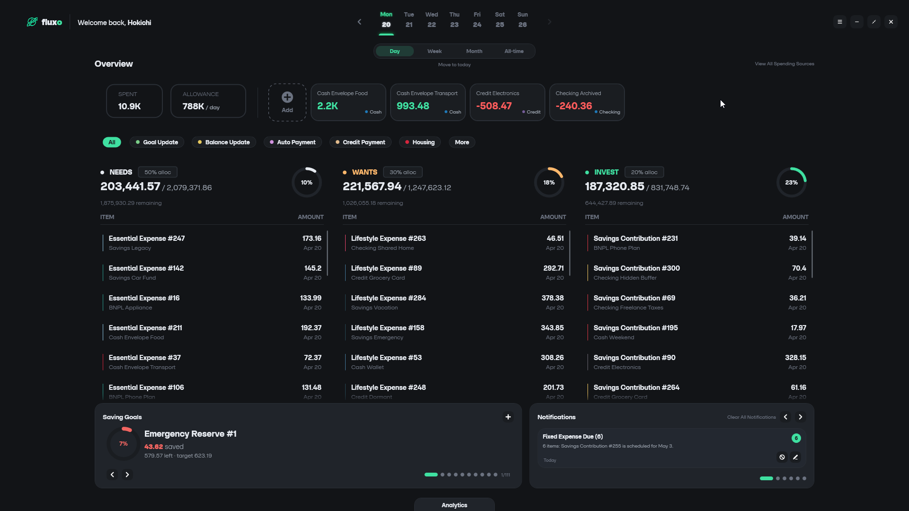
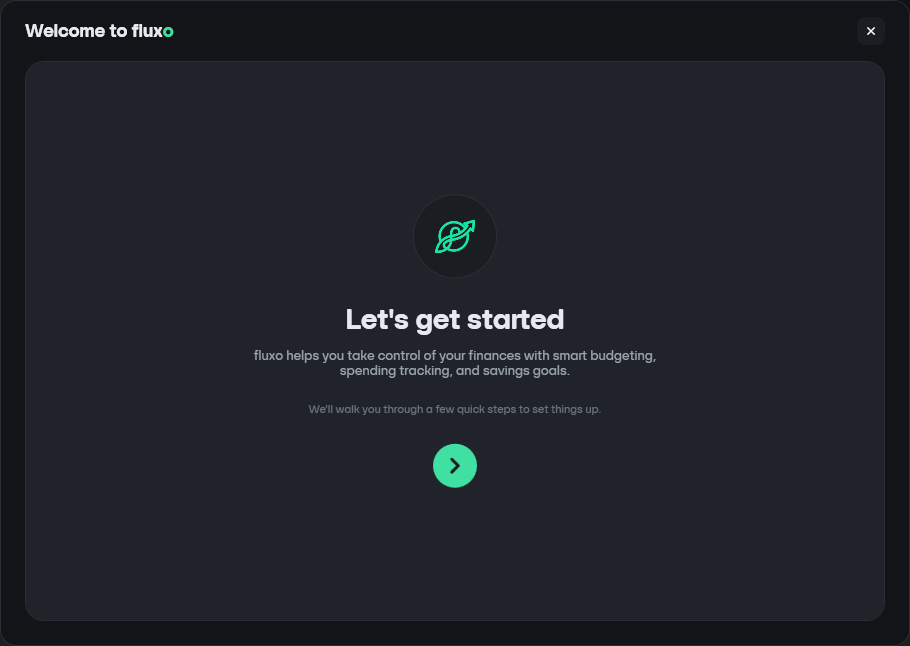
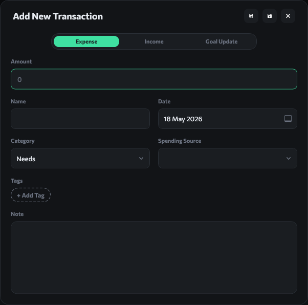
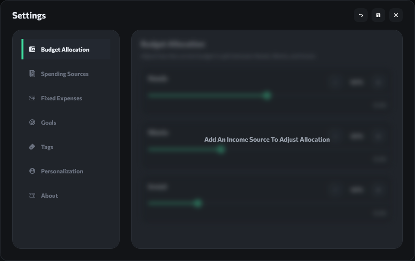
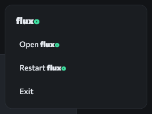

<p align="center">
  
</p>

Fluxo is a Windows personal finance app for keeping everyday money decisions visible. It helps you track spending, manage money sources, plan around recurring expenses, monitor saving goals, and stay aware of upcoming payments or budget pressure from one desktop dashboard.



## Why Use Fluxo?

Fluxo is built for people who want a practical view of where their money is going without turning budgeting into a spreadsheet project. The app centers your finances around spending sources, quick transaction entry, budget categories, reminders, and local-first storage.

With Fluxo, you can:

- Track cash, checking, credit, BNPL, and saving sources.
- Record expenses, income, and saving goal contributions.
- Split spending into Needs, Wants, and Savings/Invest categories.
- Review spending by date range, source, tag, and category.
- Watch saving goals progress toward a target amount and deadline.
- Receive reminders for payment dates, budget thresholds, low balances, and goal deadlines.
- Keep your financial data local on your Windows device.

## Getting Started

When Fluxo opens for the first time, it guides you through setup so the dashboard has enough information to be useful right away.



1. Install and open Fluxo.
2. Enter the display name you want Fluxo to use.
3. Add your spending sources, such as cash, checking accounts, credit cards, BNPL accounts, or savings.
4. Choose your budget allocation percentages for Needs, Wants, and Savings/Invest.
5. Add fixed expenses that repeat monthly.
6. Add saving goals with target amounts and deadlines.
7. Choose which financial reminders you want enabled.
8. Finish setup and start from the dashboard.

You can change these choices later from Settings.

## Dashboard Overview

The dashboard is the main workspace in Fluxo. It combines your budget, spending activity, money sources, notifications, and goals into one view.

The dashboard includes:

- **Date controls** for reviewing today, another period, or all-time activity.
- **Budget allocation** for Needs, Wants, and Savings/Invest.
- **Spending source cards** that show balances, credit usage, and account differences for the selected period.
- **Transaction buckets** that group spending by category.
- **Tag and source filters** for narrowing down the visible transactions.
- **Daily allowance and total spent** summaries.
- **Saving goal carousel** for active goals.
- **Notification panel** for reminders and action items.
- **Analytics access** for deeper spending and income review.

## Adding Transactions

Use Quick Add when you want to record something immediately.



Quick Add supports three common entries:

- **Expense**: money spent from a source, assigned to a category and tag.
- **Income**: money added to a cash, checking, or saving source.
- **Goal contribution**: money moved toward a saving goal.

For each entry, Fluxo lets you choose the source, amount, date, category, tag, goal, and notes where relevant. After saving, Fluxo updates balances, budget totals, notifications, and goal progress.

## Managing Spending Sources

Spending sources are the accounts or money pools Fluxo uses to calculate your budget and transaction impact.

Fluxo supports:

- **Cash** for physical money or cash-like balances.
- **Checking** for everyday bank accounts.
- **Credit** for credit cards with account limits and due dates.
- **BNPL** for buy-now-pay-later balances and due dates.
- **Saving** for savings accounts or reserved funds.

Sources can have balances, account limits, spent amounts, due dates, visibility settings, and enabled states. Credit and BNPL sources behave differently from cash or checking sources: expenses increase the spent amount, while payments reduce it.

## Budgeting With Needs, Wants, and Savings

Fluxo organizes spending into three budget categories:

- **Needs**: essential spending such as groceries, bills, transport, rent, or utilities.
- **Wants**: optional spending such as entertainment, dining out, hobbies, or shopping.
- **Savings/Invest**: saving goal activity and money set aside for future use.

Your allocation percentages determine how much of your available money is reserved for each category. As you add expenses, Fluxo compares category spending against those available amounts and shows remaining budget, usage percentages, and threshold warnings.

Filters help you review spending by:

- Date range.
- Spending source.
- Expense tag.
- Budget category.

## Saving Goals

Saving goals help you track progress toward a target amount.

A goal can include:

- Name.
- Target amount.
- Current amount.
- Deadline.
- Active or hidden state.

When you add a goal contribution, Fluxo records the transaction, updates the goal's current amount, and adjusts the selected source. If a goal deadline is approaching and the goal is not complete, Fluxo can show a reminder.

## Notifications and Reminders

Fluxo evaluates your current data and settings to show financial reminders.

Notifications can include:

- Upcoming credit or BNPL payments.
- Late payments.
- Fixed expenses due soon.
- Budget categories near or past their warning threshold.
- Low cash, checking, or saving balances.
- Low remaining credit availability.
- Saving goal deadlines.
- Fixed expenses processed on their scheduled date.

Some notifications include action popups. For example, payment-related reminders can help you mark items handled, and goal deadline reminders can help you decide what to do next.

## Analytics

Analytics gives you a more detailed view of money movement over a selected period.


Fluxo can summarize:

- Total income.
- Total expenses.
- Income and expenses over time.
- Spending by Needs, Wants, and Savings/Invest.
- Top spending tags.
- Goals created during the selected period.

Use analytics when you want to understand patterns instead of only entering transactions.

## Settings

Settings lets you adjust Fluxo after setup.



Settings areas include:

- **Personalization**: display name and app behavior preferences.
- **Spending sources**: account details, visibility, due dates, balances, and source types.
- **Fixed expenses**: recurring monthly expenses.
- **Saving goals**: targets, deadlines, hidden goals, and disabled goal reminders.
- **Tags**: labels and colors for expense organization.
- **Budget**: Needs, Wants, and Savings/Invest percentages.
- **Notifications**: reminder types, thresholds, and deadline timing.
- **About**: app version and update checks.

## Tray and Startup Behavior



Fluxo can run from the Windows system tray so it stays nearby without taking space on the taskbar.

Depending on your settings, Fluxo can:

- Start with Windows.
- Open directly to the tray.
- Show a startup summary popup when there are reminders.
- Minimize to the tray when closed.
- Be reopened, restarted, or exited from the tray menu.

If Fluxo appears to close but the tray icon remains, it may be using the minimize-to-tray close behavior.

## Updates

Fluxo can check for newer releases from the project's GitHub releases.

When an update is available, Fluxo can download the installer and launch it. The app may close during the update process so the installer can replace the existing files.

If update checks fail, check your internet connection and try again later.

## Your Data and Privacy

Fluxo stores financial data locally on your Windows device.

The local database is stored at:

```text
%LocalAppData%\fluxo\fluxo.db
```

Fluxo also creates startup backups under:

```text
%LocalAppData%\fluxo\backup
```

Backups are kept for a short period and older backup files are pruned automatically. If you are moving to a new device or reinstalling Windows, back up the `%LocalAppData%\fluxo` folder first.

The current app is local-first. No cloud sync is described by Fluxo's current behavior.

## Troubleshooting

### Fluxo opens in the tray

Check the Windows tray area for the Fluxo icon. Open the tray menu to show the app, restart it, or exit it.

### Fluxo does not open

Try launching Fluxo again from the Start menu or installation folder. If it still does not open, restart Windows and try again.

### Update check fails

Make sure your internet connection is available. Fluxo uses GitHub release information to check for updates, so network restrictions that block GitHub can prevent update checks.

### Installer says Fluxo is already installed

Use the installer maintenance options if available, or uninstall the existing version before installing again.

### Data looks missing after reinstall

Fluxo stores data under `%LocalAppData%\fluxo`. If that folder was removed during cleanup, the app may start with a fresh database. Check the backup folder if it still exists.

### Notifications do not appear

Open Settings and confirm that the relevant notification type is enabled. Some reminders only appear when the matching source, due date, threshold, or saving goal condition applies.

## Support

If you report a problem, include:

- Fluxo version.
- Windows version.
- What you were doing when the problem happened.
- Any screenshots that help explain the issue.
- Whether the app was running normally, from startup, from the tray, or during an update.

Project releases and issue tracking may be available from the Fluxo GitHub repository.

## Change Log

### v1.0.0:
Initial Release

### v1.0.1:
`Check for updates` implemented

### v1.0.3:
- Version bump to 1.0.3.
- Added changelog entry to the README.

### v1.0.2:
- Recurring transaction introduced for recurring planning and tracking.
- Spending and saving expanded to support richer financial records.
- Notification checklist now supports direct action flow for handling reminders from within the app.
